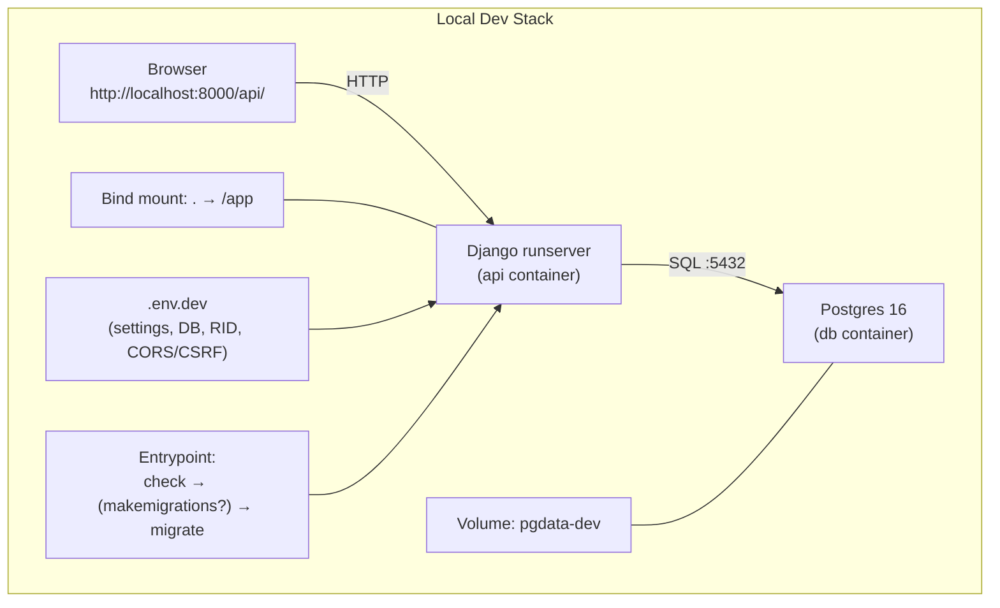
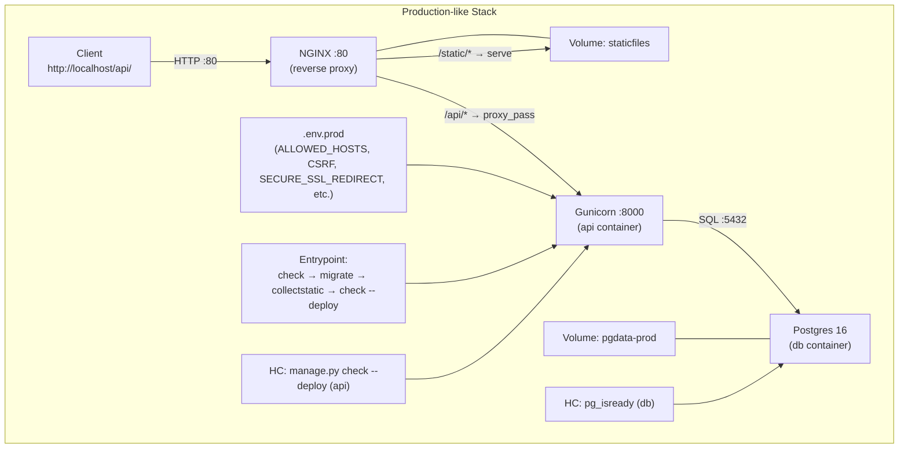

# BillyApp API

[](#)
[](#)
[](#)

Django/DRF API to register users, list users, and resolve a **deterministic cryptographic match** (AES-ECB) from `username`, `id_hex`, and `timestamp`.

---

## 🔧 Stack & Ports

| Env  | Service  | Host → Container Port                      | Notes                                    |
| ---- | -------- | ------------------------------------------ | ---------------------------------------- |
| Dev  | Postgres | 5432 → 5432                                | Volume `pgdata-dev`                      |
| Dev  | Django   | `${DJANGO_SERVER_PORT}` → same (e.g. 8000) | Bind mount `.:/app` for hot reload       |
| Prod | NGINX    | 80 → 80                                    | Public reverse proxy for `/api` & static |
| Prod | API      | (internal) → 8000                          | Gunicorn; static in `staticfiles` volume |
| Prod | Postgres | (internal) → 5432                          | Volume `pgdata-prod`                     |

**Base URLs**

* Dev: `http://localhost:8000/api/`
* Prod (default NGINX): `http://localhost/api/`

---

## ⚡ Quick Start

**Prereqs**: Docker Desktop (or Docker Engine + Compose v2) and `make`.

### 1) Create env files with real values (never commit secrets)

`.env.dev` (minimal)

```ini
DJANGO_SETTINGS_MODULE=core.settings.dev
DEBUG=True
DJANGO_SECRET_KEY=...
ALLOWED_HOSTS=127.0.0.1,localhost
CSRF_TRUSTED_ORIGINS=http://localhost:8000,http://localhost:3000
CORS_ALLOW_ALL_ORIGINS=True
CORS_ALLOWED_ORIGINS=http://localhost:3000
LANGUAGE_CODE=...
TIME_ZONE=...
LOG_LEVEL=DEBUG
DB_NAME=...
DB_USER=...
DB_PASSWORD=...
DB_HOST=...
DB_PORT=...
RID_ROTATION_SECONDS=20
DJANGO_SERVER_PORT=8000
APP_ENV=dev
RUN_TESTS_ON_START=0
AUTO_MAKEMIGRATIONS=1
GUNICORN_BIND=0.0.0.0:8000
GUNICORN_WORKERS=3
GUNICORN_TIMEOUT=60
SECURE_SSL_REDIRECT=False
SECURE_HSTS_SECONDS=0
CORS_ALLOW_CREDENTIALS=True
```

`.env.prod` (minimal)

```ini
DJANGO_SETTINGS_MODULE=core.settings.prod
DEBUG=False
DJANGO_SECRET_KEY=...
ALLOWED_HOSTS=localhost
CSRF_TRUSTED_ORIGINS=http://localhost
CORS_ALLOW_ALL_ORIGINS=False
CORS_ALLOWED_ORIGINS=
LANGUAGE_CODE=...
TIME_ZONE=...
LOG_LEVEL=INFO
DB_NAME=...
DB_USER=...
DB_PASSWORD=...
DB_HOST=...
DB_PORT=...
RID_ROTATION_SECONDS=20
APP_ENV=prod
RUN_TESTS_ON_START=0
AUTO_MAKEMIGRATIONS=0
GUNICORN_BIND=...
GUNICORN_WORKERS=3
GUNICORN_TIMEOUT=60
SECURE_SSL_REDIRECT=False
SECURE_HSTS_SECONDS=...
CORS_ALLOW_CREDENTIALS=True
```

> Enable `SECURE_SSL_REDIRECT=True` **only** when there’s real TLS in front (LB/Ingress). Otherwise you’ll see HTTP 301 redirects.

### 2) Bring stacks up

```bash
make dev-up     # dev (hot reload)
make prod-up    # production-like (NGINX + Gunicorn)
```

### 3) Run tests

```bash
make dev-test
make prod-test  # uses --no-cache to avoid stale code
```

## 👤 Admin (dev only)

On `dev` startup the entrypoint **creates/updates** a superuser:

* **username:** `admin`
* **password:** `admin`

Login:

* Dev: `http://localhost:8000/admin/`
* Behind a proxy: `http://localhost/admin/`

> Enabled **only in dev**; do not use this credential in production.

---

## 🛠 Make Commands

```bash
make dev-test     # build + pytest (dev)
make dev-up       # build + up -d (dev)
make dev-down     # down -v --remove-orphans (dev)

make prod-test    # build --no-cache + pytest (prod)
make prod-up      # build + up -d (prod)
make prod-down    # stop + remove all prod containers (no orphans)

make ps           # show active services (dev + prod)
make logs         # tail 'api' logs (auto-detect dev/prod)
make cleanup      # hard cleanup: down -v --rmi all (dev+prod) + docker system prune
```

> No orphan containers: `prod-down` also handles any `run --rm` task container created by `prod-test`.

---

## 📡 API Endpoints

**Dev base** `http://localhost:8000/api/`
**Prod base** `http://localhost/api/`

### 1) `POST /register/`

Registers a user. If `id_hex` is omitted, a 16-hex value is generated.

```bash
curl -i -X POST http://localhost:8000/api/register/ \
  -H "Content-Type: application/json" \
  -d '{"username":"alice","display_name":"Alice","id_hex":"1a2b3c4d5e6f7788"}'
```

### 2) `GET /users/list/`

```bash
curl -i http://localhost:8000/api/users/list/
```

### 3) `POST /match/`

Requires `timestamp` (int) and `cipher8_hex` (16 hex).
Helper to compute `cipher8_hex` *inside the dev container* using project code:

```bash
TS=1738888800
USERNAME="alice"
IDHEX="1a2b3c4d5e6f7788"

C8=$(
  docker compose --env-file .env.dev -f docker-compose.dev.yml run --rm api \
    python - <<'PY'
from api.crypto import compute_cipher8
print(compute_cipher8("alice","1a2b3c4d5e6f7788",1738888800).hex())
PY
)

curl -i -X POST http://localhost:8000/api/match/ \
  -H "Content-Type: application/json" \
  -d "{\"timestamp\": ${TS}, \"cipher8_hex\": \"${C8}\"}"
```

> In prod, switch the base to `http://localhost/api/...`. With `SECURE_SSL_REDIRECT=True` (without TLS) you’ll get 301 redirects.

---

## 🔐 Deterministic Crypto (RID)

* **Key derivation**: `username.lower().encode()` → right-pad with `0x00` to 16B, then slice `[:16]`.
* **Plaintext (16B)** = `id_hex (8B big-endian)` + `time_window (8B big-endian)`, where
  `time_window = timestamp // RID_ROTATION_SECONDS`.
* **Cipher**: AES-ECB(128). Take the **first 8 bytes** of the encrypted block → `cipher8_hex` (16 hex).
* Same `(username, id_hex, timestamp)` ⇒ same output (deterministic).

---

## 🗃 Database & Migrations

Model `EncounterUser`:

* `id` (BigAutoField, PK)
* `username` (unique)
* `display_name`
* `id_hex` (unique, 16 hex)
* `created_at` (auto_now_add)

Entrypoint flow:

* Wait for DB → optional `makemigrations` (`AUTO_MAKEMIGRATIONS=1`) → `migrate`
* Prod adds: `collectstatic` + `check --deploy`

---

## ✅ Tests & Coverage

* `pytest`, `pytest-django`, `pytest-cov`
* Artifacts (inside the container):

  * HTML: `coverage/htmlcov/index.html`
  * XML:  `coverage/coverage.xml`
  * JUnit: `coverage/junit.xml`

```bash
make dev-test
make prod-test
```

Open the HTML report locally (dev):

```bash
open coverage/htmlcov/index.html     # macOS
xdg-open coverage/htmlcov/index.html # Linux
```

---

## 🧭 System Design

### Dev



### Prod



---

## 📦 Project Layout

```text
.
├── Dockerfile
├── LICENSE.txt
├── Makefile
├── README.md
├── api
│   ├── apps.py
│   ├── crypto.py
│   ├── migrations/
│   ├── models.py
│   ├── serializers.py
│   ├── urls.py
│   ├── views.py
│   └── tests.py
├── core
│   ├── asgi.py
│   ├── settings/
│   │   ├── dev.py
│   │   └── prod.py
│   ├── urls.py
│   └── wsgi.py
├── deploy
│   ├── entrypoint.sh
│   ├── gunicorn.conf.py
│   └── nginx.conf
├── docker-compose.dev.yml
├── docker-compose.prod.yml
├── manage.py
├── pytest.ini
└── requirements.txt
```

---

## 📜 License

MIT — see `LICENSE.txt`.
