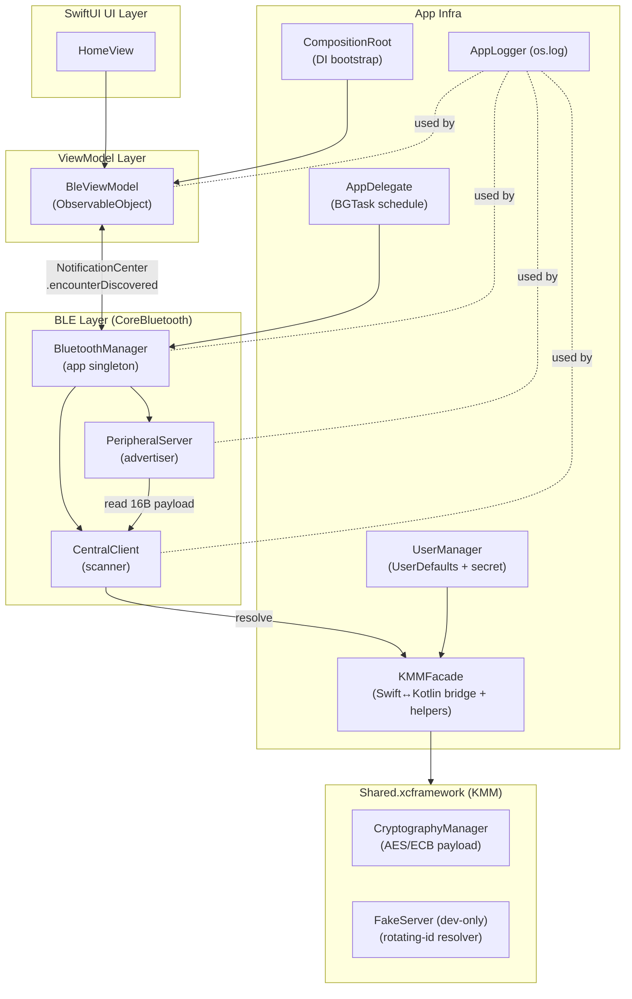
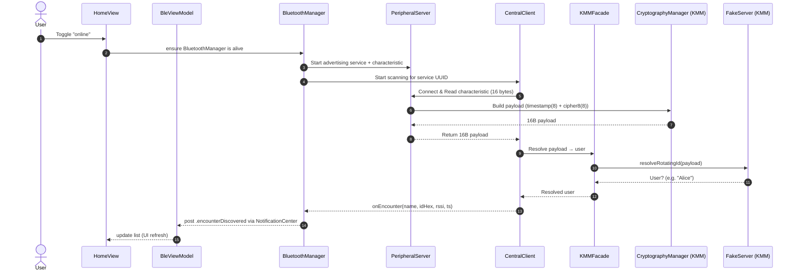
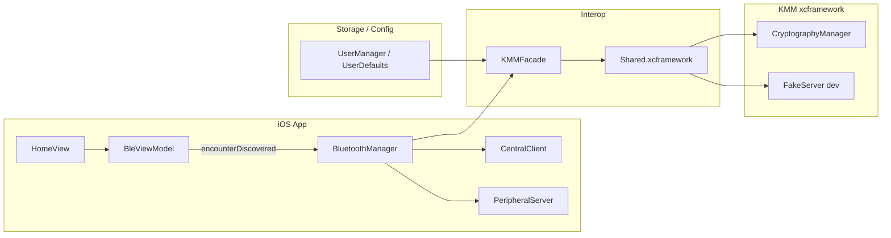

[](#)
[](#)
[](#)
[](#)
[](#)
[](#)
[](#)
[](#)

# 📱 BillyApp (iOS)

A small, focused iOS app that shows **nearby people** using **Bluetooth LE**.
The iOS app talks to a prebuilt **`Shared.xcframework`** (KMM) for **crypto** and a **dev-only fake resolver**.

---

# ⚡ Quick Start

1. **Prerequisites**

* macOS 15+, **Xcode 16.4**, Command Line Tools
* (Optional) **XcodeGen** if you ever want to re-generate the project from `project.yml`:

  ```bash
  brew install xcodegen
  ```

2. **Project open & run (Simulator)**

* Open `BillyApp.xcodeproj`
* Scheme: **BillyApp**
* Destination: any iOS 16+ simulator (e.g. *iPhone 16*)
* ▶️ Run

3. **CLI build (optional)**

```bash
# uses the checked-in xcodeproj
xcodebuild -project BillyApp.xcodeproj -scheme BillyApp \
  -destination 'platform=iOS Simulator,name=iPhone 16' build

# if you want to (re)generate the project from YAML first
xcodegen generate --spec project.yml
xcodebuild -project BillyApp.xcodeproj -scheme BillyApp \
  -destination 'platform=iOS Simulator,name=iPhone 16' build
```

> The repository already contains a ready-to-use `Shared.xcframework` at
> `BillyApp/Frameworks/Shared.xcframework` (no need to build KMM to run on iOS).

---

# 🧭 System Design (High Level)



---

# 🔄 Encounter Flow (End-to-End)



**Payload format (16 bytes total)**
`[0..7]` = timestamp (Int64, **big-endian**)
`[8..15]` = first 8 bytes of **AES-ECB(128)** of `{ idHex(8B) || timeWindow(8B) }`
(Key = user secret, from `UserManager.getSecretForBle()`; time window ~**20s** in the AES path.)

---

# 🧩 Component Responsibilities (at a glance)

* **HomeView.swift** — Simple SwiftUI screen: online/offline toggle + list of nearby people.
* **BleViewModel.swift** — Observes `.encounterDiscovered` notifications, merges encounters by name, exposes `@Published encounters`.
* **BluetoothManager.swift** — App-level BLE orchestrator. Starts **PeripheralServer** (advertising) and **CentralClient** (scanning). Registers a background processing task.
* **PeripheralServer.swift** — CBPeripheralManager that exposes a **characteristic** with a 16-byte payload: `timestamp(8) + cipher8(8)`, computed via KMM crypto.
* **CentralClient.swift** — CBCentralManager that scans, connects, reads the payload, and resolves the user via KMM, then emits an encounter.
* **KMMFacade.swift** — Swift helpers to call Kotlin (`CryptographyManager`, `FakeServer`) and to convert between `Data` and `KotlinByteArray`.
* **UserManager.swift** — Stores minimal user profile in `UserDefaults` and builds the **16-byte secret** for BLE crypto (lowercased name, padded/truncated to 16 bytes).
* **CompositionRoot.swift** — Tiny DI bootstrap: creates and wires `BleViewModel`.
* **BillyAppApp.swift / AppDelegate** — App entry, schedules `BGProcessingTask` (identifier: `com.acme.billyapp.bluetooth-processing`).
* **Logging.swift** — `os.Logger` convenience.
* **Data+Ext.swift** — Small `Data` helpers (+ endian helpers in the interop file).
* **Tests/BleViewModelTests.swift** — Unit test validating encounter merge behavior.
* **Frameworks/Shared.xcframework** — Prebuilt **static** xcframework (KMM).

  * `ios-arm64/Shared.framework/Shared` (device)
  * `ios-arm64_x86_64-simulator/shared.framework/Shared` (simulator; note **folder lowercase**, binary **uppercase**)

---

# 🗂 Project Structure (what goes where)

```text
BillyApp/
├─ App/
│  ├─ BillyAppApp.swift          # @main app + AppDelegate (BG tasks)
│  └─ CompositionRoot.swift      # DI bootstrap (creates BleViewModel)
├─ BLE/
│  ├─ BluetoothManager.swift     # Orchestrator; posts .encounterDiscovered
│  ├─ CentralClient.swift        # Scanner → reads 16B payload, resolves via KMM
│  └─ PeripheralServer.swift     # Advertiser → serves 16B payload via characteristic
├─ Features/
│  └─ Home/
│     ├─ BleViewModel.swift      # ViewModel; merges encounters; @Published list
│     └─ HomeView.swift          # SwiftUI list + online/offline toggle
├─ Frameworks/
│  └─ Shared.xcframework/        # Prebuilt static framework (KMM)
│     ├─ ios-arm64/Shared.framework/Shared
│     └─ ios-arm64_x86_64-simulator/shared.framework/Shared
├─ Resources/
│  ├─ Info.plist                 # App plist (Bluetooth usage + BG modes)
│  ├─ Base.lproj/Localizable.strings
│  └─ it.lproj/Localizable.strings
├─ SharedBridge/
│  ├─ KMMFacade.swift            # Swift↔Kotlin interop + byte conversions
│  └─ KMMInterop.swift           # Data/Array<UInt8>/KotlinByteArray helpers + endianness
├─ Tests/
│  └─ BleViewModelTests.swift    # Unit tests
└─ Utils/
   ├─ Data+Ext.swift             # Data concatenation helper
   ├─ Logging.swift              # Logger (os.log)
   └─ UserManager.swift          # UserDefaults + 16B secret + BLE online flag

BillyApp.xcodeproj/              # Checked-in, ready to open
project.yml                      # XcodeGen spec (if you want to regenerate)
```

---

# 🛠 Build & Project Settings (iOS)

**Targets**

* **BillyApp** (application)
* **BillyAppTests** (unit tests)

**Linking the Shared.xcframework (static)**

* In **Build Phases → Link Binary With Libraries** add:

  * `Shared.framework` from **both** xcframework slices:

    * `ios-arm64/Shared.framework` (device)
    * `ios-arm64_x86_64-simulator/shared.framework` (sim)
* **Embed**: leave as **Do Not Embed** (it’s static).
* You **do not** need a `Copy Frameworks` phase for static frameworks.

**Info.plist (already set)**

* `NSBluetoothAlwaysUsageDescription` (required by CoreBluetooth)
* `UIBackgroundModes` → `bluetooth-central`, `bluetooth-peripheral`, `processing`
* `BGTaskSchedulerPermittedIdentifiers` → `com.acme.billyapp.bluetooth-processing`
* `CFBundleExecutable` → `$(EXECUTABLE_NAME)`

---

# 🔐 Crypto & Data Format (iOS path)

* **Secret (16B)**: built from `UserManager.getSecretForBle()`
  → lowercase name, UTF-8 bytes, **padded/truncated** to 16 bytes.
* **Plaintext (16B)**: `idHex(8B) + timeWindow(8B)`
  where `timeWindow = timestamp // 20`.
* **Cipher**: AES-128 **ECB**, take **first 8 bytes** of the 16-byte block.
* **Payload** sent over BLE characteristic:
  `timestamp(8B, big-endian) + cipher8(8B)` → **16 bytes** total.
* **Resolution** (dev only): KMM **FakeServer** tries all known users with ±1 window.

> The **KMM** module also contains a SHA-256 based rotating-ID generator used for experiments; the **iOS app path** uses the **AES-based** scheme described above.

---

# 🧪 How to Test

**From Xcode**

* Product → Test (⌘U)

**From CLI**

```bash
xcodebuild -project BillyApp.xcodeproj \
  -scheme BillyApp \
  -destination 'platform=iOS Simulator,name=iPhone 16' \
  test
```

**What’s covered**

* `BleViewModelTests` validates that repeated encounters with the same name are **merged**.

---

# 🧯 Troubleshooting

**“`shared.framework is missing its bundle executable`” on Simulator**

* Verify the simulator slice path **and casing**:

  ```
  BillyApp/Frameworks/Shared.xcframework/ios-arm64_x86_64-simulator/shared.framework/Shared
  #                    folder:  "shared.framework" (lowercase)
  #                    binary:  "Shared"          (uppercase)
  ```
* In *Build Phases → Link Binary With Libraries*, ensure the **simulator** slice is linked.

**“CFBundleExecutable missing or invalid”**

* App `Info.plist` includes:

  ```xml
  <key>CFBundleExecutable</key><string>$(EXECUTABLE_NAME)</string>
  ```
* Clean **DerivedData** if the error persists:

  ```bash
  rm -rf ~/Library/Developer/Xcode/DerivedData/*
  ```

**App doesn’t see peers**

* Simulator cannot do real BLE radio. Run **two simulators** (works for CoreBluetooth connections over the simulated stack) or run on **two devices** for real radio behavior.
* Ensure **Background Modes** and **Bluetooth** permission string are present (already configured).

**BGTask not firing**

* BG tasks are opportunistic; for testing, keep the app foregrounded and rely on manual scans.
* Check identifier matches: `com.acme.billyapp.bluetooth-processing`.

---

# 🧱 System Design (Components Map)




---

# 📌 Adding / Changing Things

* **New screen**: create `Features/<FeatureName>/{<Feature>View.swift,<Feature>ViewModel.swift}` and inject it from `CompositionRoot`.
* **New BLE payload field**: update `PeripheralServer.buildPayload()`, keep total **16 bytes** unless you also update `CentralClient` and `FakeServer`.
* **Change rotation seconds**: update the **KMM** crypto (AES path) to keep both sides in sync.

---

# 🧳 What’s inside the KMM (brief)

* **`CryptographyManager`**: AES-ECB implementation to build the 16-byte payload used by iOS.
* **`FakeServer`** (dev): simple in-memory user registry; matches payloads with a tolerance of ±1 window.
* **Utilities**: Hex helpers, byte/long conversions, (experimental) SHA-256 rotating-ID generator.

You **do not** need to build KMM to run the iOS app—the **prebuilt** `Shared.xcframework` is shipped here.

---

# 📜 License

MIT — see `LICENSE.txt`.
