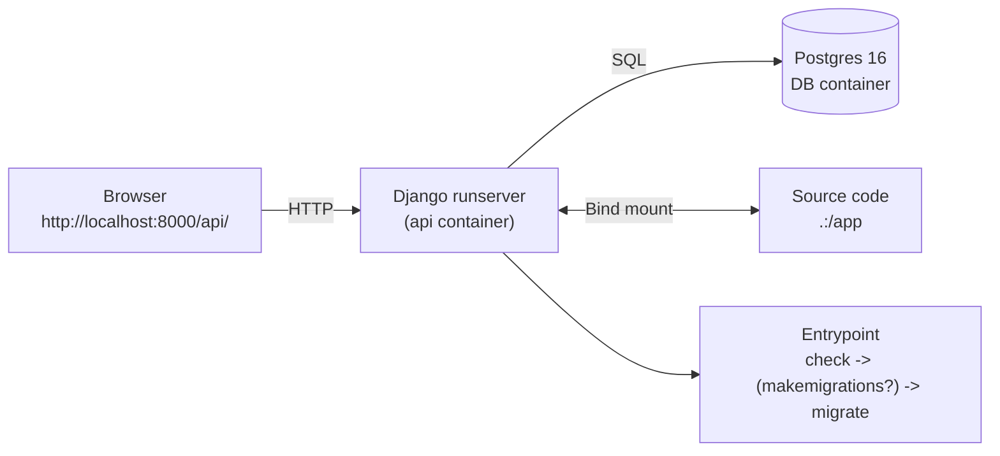
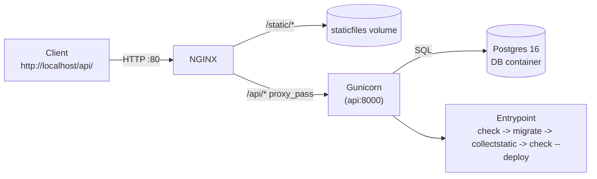

# BillyApp API

[](#)
[](#)
[](#)

Django/DRF API to register users, list users, and resolve a **deterministic cryptographic match** (AES-ECB) from `username`, `id_hex`, and `timestamp`.

---

## 🔧 Stack & Ports

| Env  | Service  | Host → Container Port                      | Notes                                    |
| ---- | -------- | ------------------------------------------ | ---------------------------------------- |
| Dev  | Postgres | 5432 → 5432                                | Volume `pgdata-dev`                      |
| Dev  | Django   | `${DJANGO_SERVER_PORT}` → same (e.g. 8000) | Bind mount `.:/app` for hot reload       |
| Prod | NGINX    | 80 → 80                                    | Public reverse proxy for `/api` & static |
| Prod | API      | (internal) → 8000                          | Gunicorn; static in `staticfiles` volume |
| Prod | Postgres | (internal) → 5432                          | Volume `pgdata-prod`                     |

**Base URLs**

* Dev: `http://localhost:8000/api/`
* Prod (default NGINX): `http://localhost/api/`

---

## ⚡ Quick Start

**Prereqs**: Docker Desktop (or Docker Engine + Compose v2), `make`.

1. Create env files **with real values** (no placeholders committed):

<details>
<summary><strong>.env.dev</strong> (minimal keys)</summary>

```
DJANGO_SETTINGS_MODULE=core.settings.dev
DEBUG=True
DJANGO_SECRET_KEY=...
ALLOWED_HOSTS=127.0.0.1,localhost
CSRF_TRUSTED_ORIGINS=http://localhost:8000,http://localhost:3000
CORS_ALLOW_ALL_ORIGINS=True
CORS_ALLOWED_ORIGINS=http://localhost:3000
LANGUAGE_CODE=...
TIME_ZONE=...
LOG_LEVEL=DEBUG
DB_NAME=...
DB_USER=...
DB_PASSWORD=...
DB_HOST=db
DB_PORT=5432
RID_ROTATION_SECONDS=20
DJANGO_SERVER_PORT=...
APP_ENV=dev
RUN_TESTS_ON_START=0
AUTO_MAKEMIGRATIONS=1
GUNICORN_BIND=0.0.0.0:8000
GUNICORN_WORKERS=...
GUNICORN_TIMEOUT=...
SECURE_SSL_REDIRECT=False
SECURE_HSTS_SECONDS=0
CORS_ALLOW_CREDENTIALS=True
```

</details>

<details>
<summary><strong>.env.prod</strong> (minimal keys)</summary>

```
DJANGO_SETTINGS_MODULE=core.settings.prod
DEBUG=False
DJANGO_SECRET_KEY=...
ALLOWED_HOSTS=...
CSRF_TRUSTED_ORIGINS=...
CORS_ALLOW_ALL_ORIGINS=False
CORS_ALLOWED_ORIGINS=...
LANGUAGE_CODE=...
TIME_ZONE=...
LOG_LEVEL=INFO
DB_NAME=...
DB_USER=...
DB_PASSWORD=...
DB_HOST=...
DB_PORT=...
RID_ROTATION_SECONDS=...
APP_ENV=prod
RUN_TESTS_ON_START=...
AUTO_MAKEMIGRATIONS=...
GUNICORN_BIND=...
GUNICORN_WORKERS=...
GUNICORN_TIMEOUT=...
SECURE_SSL_REDIRECT=...
SECURE_HSTS_SECONDS=...
CORS_ALLOW_CREDENTIALS=...
```

> Notes:
>
> * Enable `SECURE_SSL_REDIRECT=True` **only** behind real TLS (LB/Ingress); locally it will 301.
> * Use a long random `DJANGO_SECRET_KEY`.

2. Bring services up:

```bash
make dev-up     # dev environment (hot reload)
make prod-up    # production-like stack (NGINX + Gunicorn)
```

3. Run tests:

```bash
make dev-test
make prod-test  # forces --no-cache to avoid stale code
```

---

## 🛠 Make Commands

```bash
make dev-test     # build + pytest (dev)
make dev-up       # build + up -d (dev)
make dev-down     # down -v --remove-orphans (dev)

make prod-test    # build --no-cache + pytest (prod)
make prod-up      # build + up -d (prod)
make prod-down    # stop + remove all prod containers (see below)

make ps           # show active services (dev + prod)
make logs         # tail 'api' logs (auto-detect dev/prod)
make cleanup      # hard cleanup: down -v --rmi all (dev+prod) + docker system prune
```

**No orphan containers**: `prod-down` is implemented to stop the `run --rm` task container used during `prod-test`, then bring the whole prod project down (volumes, networks, orphans).

---

## 📡 API Endpoints

**Dev base** `http://localhost:8000/api/`
**Prod base** `http://localhost/api/`

### 1) `POST /register/`

Registers a user. If `id_hex` is omitted, a 16-hex value is auto-generated.

```bash
curl -i -X POST http://localhost:8000/api/register/ \
  -H "Content-Type: application/json" \
  -d '{"username":"alice","display_name":"Alice","id_hex":"1a2b3c4d5e6f7788"}'
```

### 2) `GET /users/list/`

```bash
curl -i http://localhost:8000/api/users/list/
```

### 3) `POST /match/`

Requires `timestamp` (int) and `cipher8_hex` (16 hex).
Helper to compute `cipher8_hex` **inside the dev container** with project code:

```bash
TS=1738888800
USERNAME="alice"
IDHEX="1a2b3c4d5e6f7788"

C8=$(
  docker compose --env-file .env.dev -f docker-compose.dev.yml run --rm api \
    python - <<'PY'
from api.crypto import compute_cipher8
print(compute_cipher8("alice","1a2b3c4d5e6f7788",1738888800).hex())
PY
)

curl -i -X POST http://localhost:8000/api/match/ \
  -H "Content-Type: application/json" \
  -d "{\"timestamp\": ${TS}, \"cipher8_hex\": \"${C8}\"}"
```

> In prod, swap base URL to `http://localhost/api/...`. If you later enable `SECURE_SSL_REDIRECT=True` without TLS, clients will get 301.

---

## 🔐 Deterministic Crypto (RID)

* **Key derivation**: `username.lower().encode()` → right-padded with `0x00` to 16B, then truncated to 16B.
* **Plaintext (16B)** = `id_hex(8B)` + `time_window(8B)`

  * `id_hex`: 16 hex → 8 bytes (big-endian)
  * `time_window`: `timestamp // RID_ROTATION_SECONDS` → 8 bytes (big-endian)
* **Cipher**: AES-ECB(128). Take **first 8 bytes** → `cipher8_hex` (16 hex).
* Same `(username, id_hex, timestamp)` ⇒ same output.

---

## 🗃 Database & Migrations

Model `EncounterUser`:

* `id` (BigAutoField, PK)
* `username` (unique)
* `display_name`
* `id_hex` (unique, 16 hex)
* `created_at` (auto_now_add)

Entrypoint flow:

* Wait for DB (`manage.py check` + connection)
* Optionally `makemigrations` (`AUTO_MAKEMIGRATIONS=1`)
* `migrate`
* In prod: `collectstatic` + `check --deploy`

---

## ✅ Tests & Coverage

* `pytest`, `pytest-django`, `pytest-cov`
* Artifacts (inside container):

  * HTML: `coverage/htmlcov/index.html`
  * XML:  `coverage/coverage.xml`
  * JUnit: `coverage/junit.xml`

```bash
make dev-test
make prod-test
```

Open the HTML report locally (dev):

```bash
open coverage/htmlcov/index.html     # macOS
xdg-open coverage/htmlcov/index.html # Linux
```

---

## 🧭 System Design

### Dev



### Prod



---

## 🌍 Share a Public URL (for Frontend Testing)

* **Cloudflare Tunnel** (free, simple):

  ```bash
  # Dev: expose http://localhost:8000
  cloudflared tunnel --url http://localhost:8000
  ```

  Then share `https://<random>.trycloudflare.com/api/`.

* **ngrok**:

  ```bash
  ngrok http 8000
  ```

  Share the HTTPS URL it prints (`/api/...`).

* **Prod stack**: expose NGINX on a VM/container platform (Railway/Render/Fly/EC2). Point DNS → NGINX; set `ALLOWED_HOSTS` & `CSRF_TRUSTED_ORIGINS` accordingly; enable `SECURE_SSL_REDIRECT=True` behind TLS.

---

## 🧰 Troubleshooting

* **301 on prod**: likely `SECURE_SSL_REDIRECT=True` without TLS. Disable locally or test via HTTPS behind a proper proxy.

* **“Stale code” in prod-test**: `make prod-test` already uses `--no-cache`. For a guaranteed reset:

  ```bash
  make cleanup && make prod-test
  ```

* **Containers left running after prod-test / prod-down**: handled by `Makefile` (stops any `run --rm` task container, then `down -v --remove-orphans`). If you still see leftovers, run `make cleanup`.

* **Ports already in use**: change `DJANGO_SERVER_PORT` (dev) or host port mapping for NGINX (prod).

* **Missing envs**: entrypoint requires critical variables; fill `.env.*` before `make up`.

---

## 📦 Project Layout (top-level)

```
.
├── api/                 # app: models, serializers, views, urls, tests
├── core/                # settings (dev/prod), urls, WSGI/ASGI
├── deploy/              # entrypoint, gunicorn, nginx
├── docker-compose.*.yml # dev & prod stacks
├── Dockerfile
├── Makefile
├── pytest.ini
└── requirements.txt
```

---

## 📜 License

MIT — see `LICENSE.txt`.